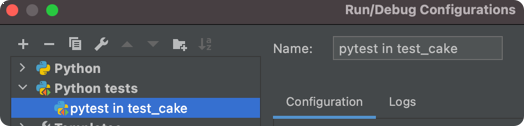

# A Python AWS Lambda

A simple `Python` handler that sends a cake recipe to `httpbin.org`.  The server echos back the recipe. 

It is single `HTTP Post` request with a single `environment variable`.

### Interesting pieces:

- It builds on `CircleCI`, when you push code changes
- You can run `lambda` locally - inside `PyCharm` - via a `PyCharm plug-in`
- You can test the `CircleCI` setup locally

### Run lambda locally from command line

```
pip3 install python-lambda-local
python-lambda-local -f rm_handler demo_lambda.py inputs.json
```
To enabled `control + r` to run the configuration, follow this AWS article:

### Run lambda locally within PyCharm

https://medium.com/@bezdelev/how-to-test-a-python-aws-lambda-function-locally-with-pycharm-run-configurations-6de8efc4b206

### Run Unit Tests locally within PyCharm

When testing locally, instead of running from `terminal`, you can add a `New Configuration` in `PyCharm`.

This is a simple way to pass in `Environment Variables` and checks `Unit Tests` before passing to `CircleCI`.





### Build locally with CircleCI

```bash
circleci config process .circleci/config.yml > process.yml
circleci local execute -c process.yml --job build-and-test -e SECRET_SAUCE=chocolate
```


### Deploy to AWS Lambda

#### Create

```bash
aws lambda create-function \
    --function-name MyPyLambdaFunction \
    --runtime python3.7 \
    --zip-file fileb://my-deployment-package.zip \
    --handler demo_lambda.rm_handler \
    --role arn:aws:iam::XXXXXXXXX:role/rm-lambda-demo-role
```

#### Zip up code and dependencies

```bash
 pip3 install -r requirements.txt --target ./package
cd package
zip -r ../my-deployment-package.zip .
cd ..
zip -g my-deployment-package.zip demo_lambda.py
```

#### Update

Code change:

`zip -g my-deployment-package.zip demo_lambda.py`

Then upload:

```bash
aws lambda update-function-code \
    --function-name  MyPyLambdaFunction \
    --zip-file fileb://my-deployment-package.zip
```

### Invoke

```bash
aws lambda invoke out.txt \
    --function-name MyPyLambdaFunction \
    --log-type Tail \
    --query 'LogResult' \
    --output text |  base64 -d
```

### Invoke and debug

```bash
 aws lambda invoke out.txt --debug\
    --function-name MyPyLambdaFunction \
    --log-type Tail \
    --query 'LogResult' \
    --output text |  base64 -d
```


### TBD

- Pass in `export SECRET_SAUCE="chocolate"`

- Run the deployment to `lambda` from inside of `PyCharm`


