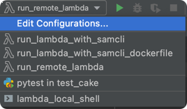
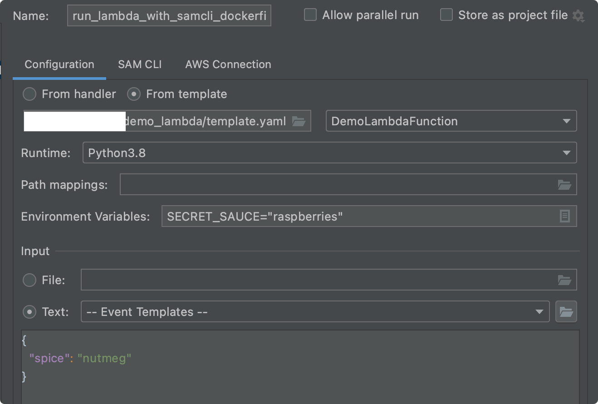

# Get a cake recipe, with PyCharm, Docker and AWS Lambda

A simple `Python function` that sends a cake recipe to `httpbin.org`.  The server echos back the recipe.

It is single `HTTP Post` request with a single `environment variable`.

## Run an AWS Lambda from within PyCharm

You can configure `PyCharm` in many different ways with `PyCharm plug-ins` and `AWS` helpers:

<!-- TOC depthfrom:2 depthto:2 withlinks:true updateonsave:true orderedlist:false -->

- [Run an AWS Lambda from within PyCharm](#run-an-aws-lambda-from-within-pycharm)
- [Run lambda locally, inside PyCharm, with a shell script](#run-lambda-locally-inside-pycharm-with-a-shell-script)
- [Run lambda locally, with sam](#run-lambda-locally-with-sam)
- [Run lambda locally, with AWS SAM and a Dockerfile](#run-lambda-locally-with-aws-sam-and-a-dockerfile)
- [Deploy to AWS Lambda from PyCharm](#deploy-to-aws-lambda-from-pycharm)
- [Deploy to AWS Lambda from command line](#deploy-to-aws-lambda-from-command-line)
- [Run Unit Tests locally](#run-unit-tests-locally)
- [Build locally with CircleCI](#build-locally-with-circleci)

<!-- /TOC -->

After setting up new `configurations` my final `PyCharm` setup was:





## Run lambda locally, inside PyCharm, with a shell script

The quickest way to run a `lambda` inside of `PyCharm` used a `shell script`.

CHeck the `Jetbrains plug-in` is actually installed:


Install the `python dependency`:

```bash
pip3 install python-lambda-local
```

Set up the `configuration`:


The shell-script:

```bash
#!/bin/bash
echo "[*]running lambda from Pycharm"
export SECRET_SAUCE="sprinkles"
python-lambda-local -f "$1" "$2" "$3"
```

## Run lambda locally, with sam

From [Amazon](https://docs.aws.amazon.com/serverless-application-model/latest/developerguide/serverless-sam-cli-install.html):

> AWS SAM provides you with a command line tool, the AWS SAM CLI, that makes it easy for you to create and manage serverless applications.

Get the `aws-sam-cli` client:

```bash
brew install aws-sam-cli
brew upgrade
brew update
brew tap aws/tap
brew install aws-sam-cli
```

Install the `plug-in`:


Then - assuming you have `Docker Desktop` installed - you just need to setup a new `configuration` in `PyCharm`:


Then specify that you want to run function inside a container:


## Run lambda locally, with AWS SAM and a Dockerfile

Amazon released [instructions](https://aws.amazon.com/blogs/compute/using-container-image-support-for-aws-lambda-with-aws-sam/) on this option. 

From the command line you can type `sam init`.   `AWS SAM` will auto create an entire Python project within seconds. 

To try this option, select options:

1. AWS Quick Start Templates
2. Image
3. Amazon/python3.8-base

This will create a demo complete `lambda` project.  

If you already have a project, just copy the `template.yaml` file that `sam` reads.  Within PyCharm you can now create a `new configuration` that points to the `yaml` file:



## Deploy to `AWS Lambda` from PyCharm

After you have the `aws-sam-cli` client:


For more details:

<https://medium.com/axcess-io/executing-aws-lambda-locally-in-pycharm-and-deploy-to-aws-3b38ab459a61>

## Deploy to `AWS Lambda` from command line

> AWS SAM provides local development support for zip-based and container-based Lambda functions. 

### Create

```bash
aws lambda create-function \
    --function-name MyPyLambdaFunction \
    --runtime python3.7 \
    --zip-file fileb://my-deployment-package.zip \
    --handler demo_lambda.rm_handler \
    --role arn:aws:iam::XXXXXXXXX:role/rm-lambda-demo-role
```

### Compress code and dependencies

```bash
pip3 install -r requirements.txt --target ./package
cd package
zip -r ../my-deployment-package.zip .
cd ..
zip -g my-deployment-package.zip app.py
```

### Update

Code change:

`zip -g my-deployment-package.zip demo_lambda.py`

Then upload:

```bash
aws lambda update-function-code \
    --function-name  MyPyLambdaFunction \
    --zip-file fileb://my-deployment-package.zip
```

### Invoke

```bash
aws lambda invoke out.txt \
    --function-name MyPyLambdaFunction \
    --log-type Tail \
    --query 'LogResult' \
    --output text |  base64 -d
```

## Run Unit Tests locally

When testing locally - before deploying to `CircleCI` or `AWS` - instead of running `pytest` commands from `terminal`, you can add a `New Configuration` in `PyCharm`.  This is a simple way to pass in `Environment Variables` and check `Unit Tests` pass without leaving `PyCharm`.


## Build locally with CircleCI

The repo pushed to `github`.  It was configured to auto-build on `CircleCI`, when you pushed code changes.
All the `CircleCI` setup locally could be tested locally.
  
```bash
circleci config process .circleci/config.yml > process.yml
circleci local execute -c process.yml --job build-and-test -e SECRET_SAUCE=chocolate
```

References:

<https://github.com/CircleCI-Public>
